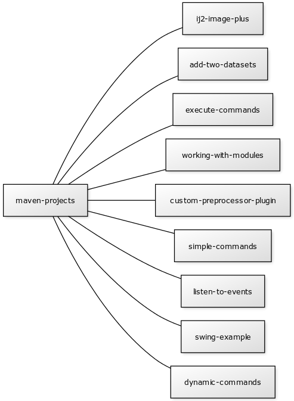

This project contains example code for working with
[ImageJ](https://imagej.net/ImageJ) and [SciJava](https://imagej.net/SciJava).

JAVA PROJECTS
-------------

For the
[type-safety-inclined](https://softwareengineering.stackexchange.com/a/38257),
this repository also contains Maven projects written in Java, located in the
`maven-projects` subfolder of this repository.

Use the "Open in Gitpod" button above to run the (non-GUI) Java projects on the
cloud using [Gitpod](https://gitpod.io), with no local installation necessary.

You can import these projects into your favorite IDE:

  * Eclipse: File > Import > Existing Maven Projectsnotebooks
  * NetBeans: File > Open Project
  * IDEA: File > Open Project... (select pom.xml)

Or build and run from the command line:

    mvn
    cd maven-projects/simple-commands
    mvn -Pexec -Dmain-class=GradientImage

LICENSING
---------

To the extent possible under law, the ImageJ developers have waived
all copyright and related or neighboring rights to this tutorial code.

See the [CC0 1.0 Universal license](https://creativecommons.org/publicdomain/zero/1.0/) for details.

SEE ALSO
--------

* The [ImageJ Tutorials](https://imagej.net/Tutorials) and [Development](https://imagej.net/Development) sections of the ImageJ wiki.

