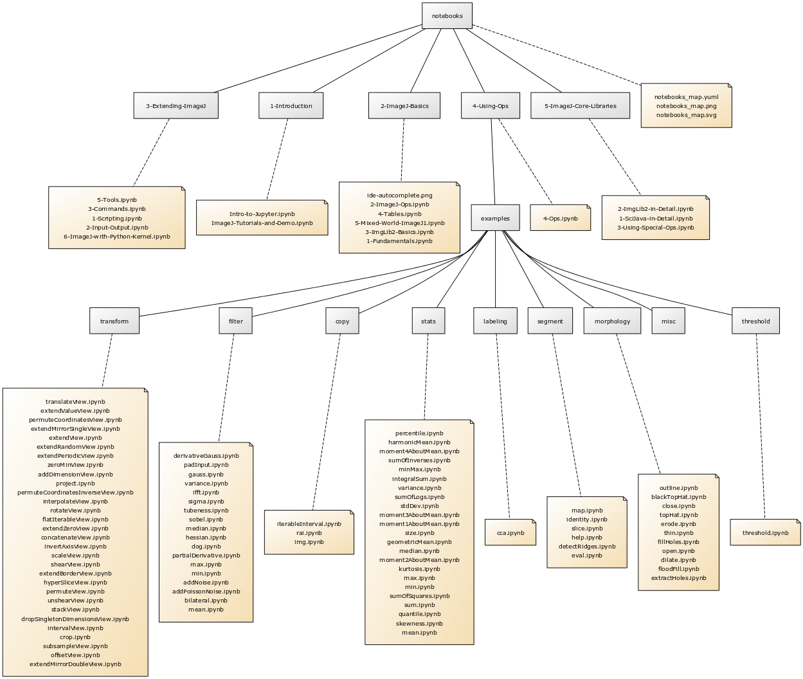

JUPYTER NOTEBOOKS
-----------------

yUML map

The easiest way to get started with the ImageJ and SciJava APIs is via the
[ImageJ Jupyter notebooks](https://imagej.github.io/tutorials),
located in the `notebooks` subfolder of this repository.

Use the "launch binder" badge above to try the Jupyter notebooks on the cloud
using [Binder](https://mybinder.org), with no local installation necessary.

The introductory notebooks use the Groovy kernel from
[BeakerX](https://beakerx.com). Several other JVM-based kernels
are usable as well, including Clojure, Java, Kotlin and Scala.

There are also notebooks using the standard Python kernel plus
the [pyimagej](https://pypi.org/project/pyimagej) package,
enabling use of ImageJ from Python programs.

There is [more than one way to install Jupyter](https://jupyter.org/install),
but here is the procedure we recommend to get started quickly:

1. Install [Miniconda](https://conda.io/miniconda.html).
2. Clone this `imagej/tutorials` repository.
3. Open a console and `cd` to your cloned working copy.
4. `conda env create -f environment.yml` to create a conda environment with the
   dependencies these notebooks need.
5. `conda activate scijava` to activate the environment.
6. `jupyter notebook` to launch Jupyter Notebook in a web browser window.
7. In the browser, click into `notebooks`, then click on the
   `ImageJ-Tutorials-and-Demo.ipynb` notebook to open it.

Learn more about Jupyter Notebook on [its web site](https://jupyter.org).
